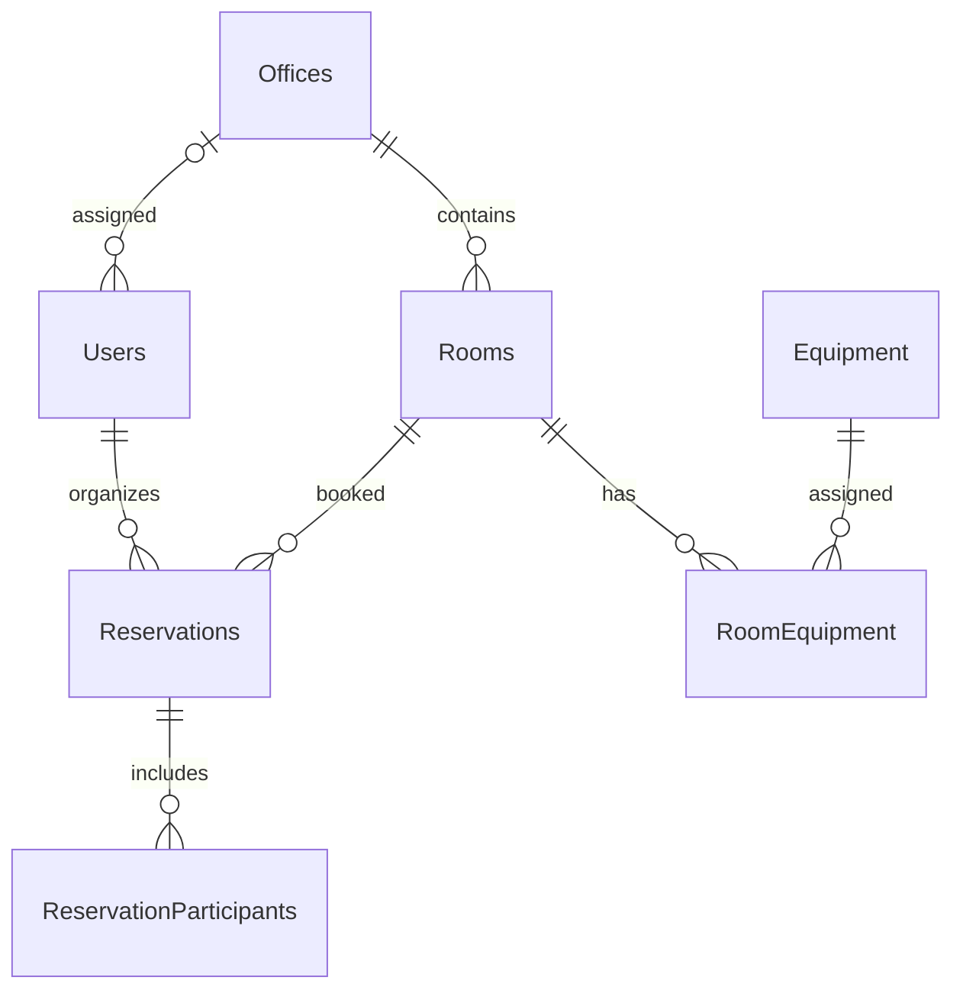

# Meeting Room Booking

Staj projesi: toplantı odası rezervasyon sistemi. Veritabanı şeması, örnek veriler, JWT kimlik doğrulama ile ofis ve oda API'leri hazırdır. Rezervasyon API'si sonraki aşamada eklenecektir.

## Gerekenler

- .NET 8 SDK veya üzeri
- Git
- MySQL 8 veya üzeri (veritabanı aşamasında kullanılacak)

## Veritabanı modelini kurma (Windows PowerShell)

1. `dotnet --version` komutuyla SDK'nın kurulu olduğunu kontrol et.
2. MySQL 8 sunucusunun çalıştığından emin ol.
3. `Copy-Item src/MeetingRoomBooking.Api/appsettings.Example.json src/MeetingRoomBooking.Api/appsettings.json` çalıştır. Oluşan `appsettings.json` içindeki `YOUR_DB_USER` ve `YOUR_DB_PASSWORD` alanlarını kendi yerel MySQL bilgilerinle değiştir. `Seed:DemoPassword` alanına en az 12 karakterlik ayrı bir test şifresi; `Jwt:Key` alanına en az 32 baytlık rastgele, gizli bir değer yaz. Bu dosyayı Git'e ekleme.
4. Repo kökünde `dotnet restore MeetingRoomBooking.sln` ve `dotnet build MeetingRoomBooking.sln` çalıştır.
5. `dotnet tool restore` çalıştır.
6. `dotnet ef database update --project src/MeetingRoomBooking.Data --startup-project src/MeetingRoomBooking.Api` çalıştır. Repodaki hazır migration veritabanına uygulanır; yeniden `migrations add InitialCreate` çalıştırma.
7. `dotnet run --project src/MeetingRoomBooking.Api --no-launch-profile -- --urls http://localhost:5080` çalıştır.
8. Tarayıcıda `http://localhost:5080/swagger` ve `http://localhost:5080/api/status` adreslerini aç.

`src/MeetingRoomBooking.Api/appsettings.Example.json` yalnızca ayarların biçimini gösterir. Gerçek bağlantı ve JWT sırları Git'e yüklenmez. `InitialCreate` migration dosyaları repoda bulunur; içlerinde şifre olmamalıdır. Model değişikliği yapıldığında yeni isimli migration oluşturulur.

## Veritabanı şeması

`RevokedTokens` tablosu JWT çıkış işlemleri için ayrılmıştır. Çakışma koruması rezervasyon API'si aşamasında MySQL transaction ve oda satırını `SELECT ... FOR UPDATE` ile kilitleyerek uygulanacaktır. Oluşturma ve düzenleme işlemleri aynı kilit üzerinden geçecek; kilit altındayken aktif rezervasyonların saatleri yeniden kontrol edilecektir.

## Örnek kullanıcılar

Uygulama ilk açıldığında 2 ofis, 8 oda, 3 kullanıcı ve 2 örnek rezervasyon oluşturulur. Tekrar açıldığında aynı veriler yeniden eklenmez.

| Rol | E-posta | Yetkili ofis |
| --- | --- | --- |
| Admin | admin@meeting.test | Tüm ofisler |
| Ofis Yöneticisi | manager@meeting.test | İstanbul |
| Çalışan | employee@meeting.test | İstanbul |

Üçünün de şifresi yerel `appsettings.json` dosyasında belirlediğin `Seed:DemoPassword` değeridir. Şifreler veritabanında yalnızca hash olarak tutulur.

## Kimlik doğrulama API'si

| Yöntem ve adres | İşlem | Yetki |
| --- | --- | --- |
| `POST /api/auth/register` | Çalışan hesabı açar (`fullName`, `email`, `password`, isteğe bağlı `officeId`) | Herkes |
| `POST /api/auth/login` | Giriş yapar, 1 saatlik JWT verir (`email`, `password`) | Herkes |
| `GET /api/auth/me` | Giriş yapan kullanıcıyı gösterir | Giriş gerekli |
| `POST /api/auth/logout` | Gönderilen JWT'yi geçersiz kılar | Giriş gerekli |
| `PUT /api/users/{id}/role` | Rolü değiştirir (`role`, yönetici için gerekirse `officeId`) | Yalnızca Admin |

Swagger'da önce `POST /api/auth/login` ile giriş yap. Dönen yanıttaki `token` değerini kopyala; sağ üstteki **Authorize** düğmesine yalnızca token'ı yapıştır. Yetki gerektiren endpoint'leri bundan sonra deneyebilirsin. Yanlış rol 403, eksik veya geçersiz token 401 döner. Rol değişince eski token artık kullanılamaz; kullanıcı yeni rolü için tekrar giriş yapar.

## Ofis API'si

| Yöntem ve adres | İşlem | Yetki |
| --- | --- | --- |
| `GET /api/offices?page=1&pageSize=10` | Ofisleri sayfalı listeler (`items`, `totalCount`) | Giriş gerekli |
| `GET /api/offices/{id}` | Tek ofisi gösterir | Giriş gerekli |
| `POST /api/offices` | Ofis oluşturur (`name`, `city`) | Admin |
| `PUT /api/offices/{id}` | Ofis adı ve şehrini değiştirir | Admin |
| `DELETE /api/offices/{id}` | Bağlı odası veya kullanıcısı olmayan ofisi siler | Admin |

## Oda ve ekipman API'si

| Yöntem ve adres | İşlem | Yetki |
| --- | --- | --- |
| `GET /api/equipment?page=1&pageSize=10` | Ekipmanları sayfalı listeler | Giriş gerekli |
| `POST /api/equipment` | Ekipman ekler (`name`) | Admin |
| `GET /api/rooms?page=1&pageSize=10` | Odaları sayfalı listeler | Giriş gerekli |
| `GET /api/rooms/{id}` | Oda ayrıntılarını ve ekipmanlarını gösterir | Giriş gerekli |
| `POST /api/rooms` | Oda oluşturur | Admin, kendi ofisinde Ofis Yöneticisi |
| `PUT /api/rooms/{id}` | Odayı ve ekipmanlarını değiştirir; `isActive` ile pasifleştirebilir | Admin, kendi ofisinde Ofis Yöneticisi |
| `DELETE /api/rooms/{id}` | Hiç rezervasyonu olmayan odayı siler | Admin, kendi ofisinde Ofis Yöneticisi |

Oda listesi `officeId`, `minCapacity`, `equipmentId` ve `isActive` sorgu parametreleriyle filtrelenebilir. Oda oluşturma gövdesi örneği: `{ "officeId": 1, "name": "Yeni Oda", "capacity": 6, "floor": 2, "isActive": true, "equipmentIds": [1, 3] }`. Güncelleme gövdesinde aynı alanlar kullanılır, ancak odanın `officeId` değeri değiştirilemez. Ekipman ID'lerini `GET /api/equipment` yanıtından al. Rezervasyonu olan odalar silinmez; gerekirse `isActive: false` ile pasifleştirilir.

Bu aşamada rezervasyon API'si, boş oda araması, raporlama ve arayüz henüz uygulanmadı. Eşzamanlı çakışma kontrolü rezervasyon aşamasında tamamlanacaktır.
