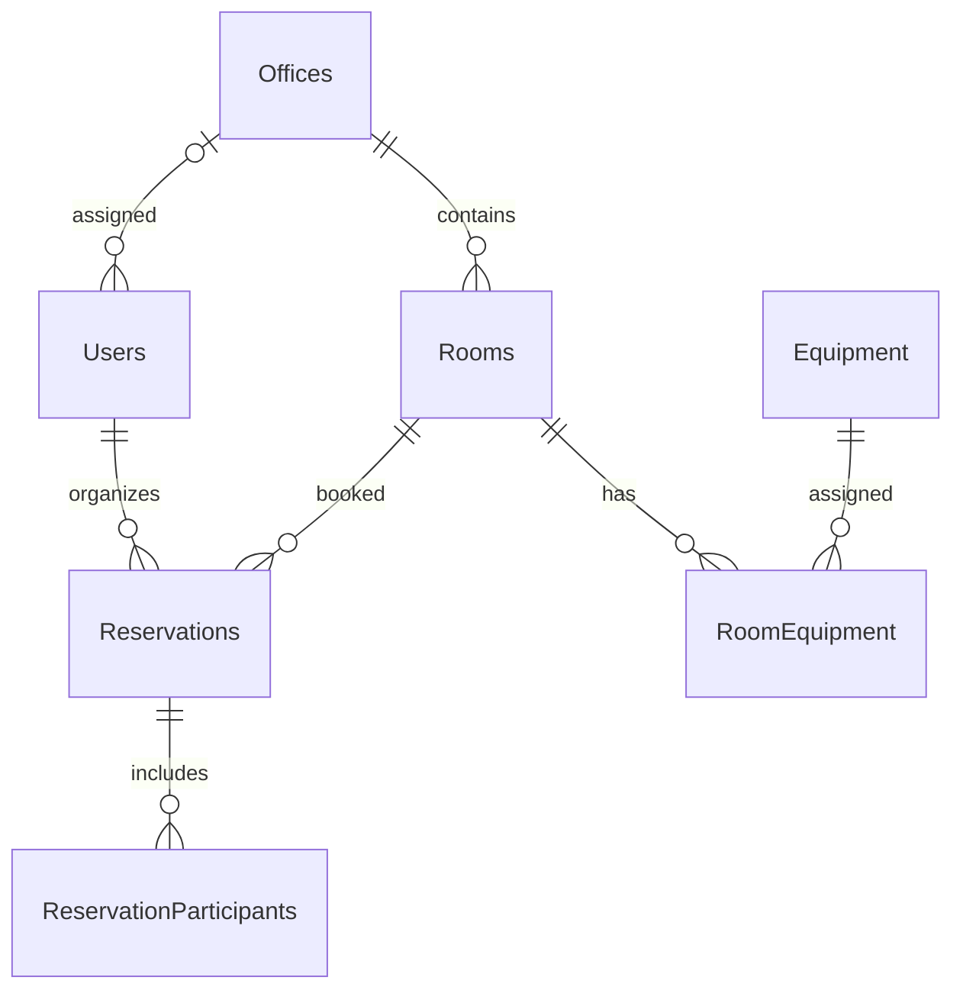

# Meeting Room Booking

Staj projesi: toplantı odası rezervasyon sistemi. Veritabanı şeması, örnek veriler, JWT kimlik doğrulama, ofis/oda ve rezervasyon API'leri, boş oda araması, oda kullanım raporu ve giriş/kayıt arayüzü hazırdır. Diğer arayüz ekranları sonraki aşamalardadır.

## Gerekenler

- .NET 8 SDK veya üzeri
- Git
- MySQL 8 veya üzeri (veritabanı aşamasında kullanılacak)

## Veritabanı modelini kurma (Windows PowerShell)

1. `dotnet --version` komutuyla SDK'nın kurulu olduğunu kontrol et.
2. MySQL 8 sunucusunun çalıştığından emin ol.
3. `Copy-Item src/MeetingRoomBooking.Api/appsettings.Example.json src/MeetingRoomBooking.Api/appsettings.json` çalıştır. Oluşan `appsettings.json` içindeki `YOUR_DB_USER` ve `YOUR_DB_PASSWORD` alanlarını kendi yerel MySQL bilgilerinle değiştir. `Seed:DemoPassword` alanına en az 12 karakterlik ayrı bir test şifresi; `Jwt:Key` alanına en az 32 baytlık rastgele, gizli bir değer yaz. Bu dosyayı Git'e ekleme.
4. Repo kökünde `dotnet restore MeetingRoomBooking.sln` ve `dotnet build MeetingRoomBooking.sln` çalıştır.
5. `dotnet tool restore` çalıştır.
6. `dotnet ef database update --project src/MeetingRoomBooking.Data --startup-project src/MeetingRoomBooking.Api` çalıştır. Repodaki hazır migration veritabanına uygulanır; yeniden `migrations add InitialCreate` çalıştırma.
7. `dotnet run --project src/MeetingRoomBooking.Api --no-launch-profile -- --urls http://localhost:5080` çalıştır.
8. Tarayıcıda `http://localhost:5080/swagger` ve `http://localhost:5080/api/status` adreslerini aç.

`src/MeetingRoomBooking.Api/appsettings.Example.json` yalnızca ayarların biçimini gösterir. Gerçek bağlantı ve JWT sırları Git'e yüklenmez. `InitialCreate` migration dosyaları repoda bulunur; içlerinde şifre olmamalıdır. Model değişikliği yapıldığında yeni isimli migration oluşturulur.

## Veritabanı şeması

`RevokedTokens` tablosu JWT çıkış işlemleri için ayrılmıştır. Rezervasyon oluşturma işleminde `READ COMMITTED` MySQL transaction başlatılır ve ilgili `Rooms` satırı `SELECT ... FOR UPDATE` ile kilitlenir. Aktif rezervasyonların çakışması (`StartUtc < yeniBitiş` ve `EndUtc > yeniBaşlangıç`) kilit tutulurken sorgulanır; yeni rezervasyon ve katılımcıları aynı transaction içinde kaydedilip ardından commit edilir. Aynı odaya gelen ikinci istek kilit açılana kadar bekler, sonra güncel rezervasyonları görür ve çakışıyorsa 409 `ROOM_CONFLICT` döner. Düzenleme işleminde eski ve yeni odanın satırları ID sırasıyla kilitlenir; önce mevcut rezervasyonun yeri tekrar okunur, sonra hedef odanın çakışma/kapasite kuralları kontrol edilir. İptal de oda kilidini kullanır ve satırı silmek yerine `Cancelled` durumuna geçirir. Oda kapasitesini veya aktifliğini değiştiren ve oda silen işlemler de aynı satır kilidini kullanır. `READ COMMITTED`, kilit beklemesi bittikten sonraki okumanın yeni bir görünüm almasını sağlar. Bu garanti, uygulamanın bütün rezervasyon yazma yolları aynı kilit düzenini kullandığında geçerlidir; veritabanına uygulamayı atlayarak yapılan doğrudan yazmalar bu kurala tabi değildir.

## Örnek kullanıcılar

Uygulama ilk açıldığında 2 ofis, 8 oda, 3 kullanıcı ve 2 örnek rezervasyon oluşturulur. Tekrar açıldığında aynı veriler yeniden eklenmez.

| Rol | E-posta | Yetkili ofis |
| --- | --- | --- |
| Admin | admin@meeting.test | Tüm ofisler |
| Ofis Yöneticisi | manager@meeting.test | İstanbul |
| Çalışan | employee@meeting.test | İstanbul |

Üçünün de şifresi yerel `appsettings.json` dosyasında belirlediğin `Seed:DemoPassword` değeridir. Şifreler veritabanında yalnızca hash olarak tutulur.

## Kimlik doğrulama API'si

| Yöntem ve adres | İşlem | Yetki |
| --- | --- | --- |
| `POST /api/auth/register` | Çalışan hesabı açar (`fullName`, `email`, `password`, isteğe bağlı `officeId`) | Herkes |
| `POST /api/auth/login` | Giriş yapar, 1 saatlik JWT verir (`email`, `password`) | Herkes |
| `GET /api/auth/me` | Giriş yapan kullanıcıyı gösterir | Giriş gerekli |
| `POST /api/auth/logout` | Gönderilen JWT'yi geçersiz kılar | Giriş gerekli |
| `PUT /api/users/{id}/role` | Rolü değiştirir (`role`, yönetici için gerekirse `officeId`) | Yalnızca Admin |

Swagger'da önce `POST /api/auth/login` ile giriş yap. Dönen yanıttaki `token` değerini kopyala; sağ üstteki **Authorize** düğmesine yalnızca token'ı yapıştır. Yetki gerektiren endpoint'leri bundan sonra deneyebilirsin. Yanlış rol 403, eksik veya geçersiz token 401 döner. Rol değişince eski token artık kullanılamaz; kullanıcı yeni rolü için tekrar giriş yapar.

## Ofis API'si

| Yöntem ve adres | İşlem | Yetki |
| --- | --- | --- |
| `GET /api/offices?page=1&pageSize=10` | Ofisleri sayfalı listeler (`items`, `totalCount`) | Giriş gerekli |
| `GET /api/offices/{id}` | Tek ofisi gösterir | Giriş gerekli |
| `POST /api/offices` | Ofis oluşturur (`name`, `city`) | Admin |
| `PUT /api/offices/{id}` | Ofis adı ve şehrini değiştirir | Admin |
| `DELETE /api/offices/{id}` | Bağlı odası veya kullanıcısı olmayan ofisi siler | Admin |

## Oda ve ekipman API'si

| Yöntem ve adres | İşlem | Yetki |
| --- | --- | --- |
| `GET /api/equipment?page=1&pageSize=10` | Ekipmanları sayfalı listeler | Giriş gerekli |
| `POST /api/equipment` | Ekipman ekler (`name`) | Admin |
| `GET /api/rooms?page=1&pageSize=10` | Odaları sayfalı listeler | Giriş gerekli |
| `GET /api/rooms/{id}` | Oda ayrıntılarını ve ekipmanlarını gösterir | Giriş gerekli |
| `POST /api/rooms` | Oda oluşturur | Admin, kendi ofisinde Ofis Yöneticisi |
| `PUT /api/rooms/{id}` | Odayı ve ekipmanlarını değiştirir; `isActive` ile pasifleştirebilir | Admin, kendi ofisinde Ofis Yöneticisi |
| `DELETE /api/rooms/{id}` | Hiç rezervasyonu olmayan odayı siler | Admin, kendi ofisinde Ofis Yöneticisi |

Oda listesi `officeId`, `minCapacity`, `equipmentId` ve `isActive` sorgu parametreleriyle filtrelenebilir. Oda oluşturma gövdesi örneği: `{ "officeId": 1, "name": "Yeni Oda", "capacity": 6, "floor": 2, "isActive": true, "equipmentIds": [1, 3] }`. Güncelleme gövdesinde aynı alanlar kullanılır, ancak odanın `officeId` değeri değiştirilemez. Ekipman ID'lerini `GET /api/equipment` yanıtından al. Rezervasyonu olan odalar silinmez; gerekirse `isActive: false` ile pasifleştirilir.

## Boş oda araması

`GET /api/rooms/available` giriş yapan tüm roller tarafından kullanılabilir. `startsAt` ve `endsAt` zorunludur; Türkiye saatini açıkça `+03:00` zaman dilimiyle gönder. Swagger'da gelecekteki bir gün için `startsAt=2026-11-10T12:00:00+03:00`, `endsAt=2026-11-10T13:00:00+03:00`, `officeId=1`, `minCapacity=8`, `equipmentId=1`, `page=1`, `pageSize=10` değerleriyle deneyebilirsin (günü deneme tarihine göre değiştir). Yanıt `items`, `page`, `pageSize`, `totalCount` içerir.

Arama yalnızca aktif odaları döndürür. Aktif rezervasyonlardan aralıkla kesişenler ilgili odayı eler; iptal edilmiş rezervasyonlar odayı meşgul etmez. `minCapacity` toplam kişi sayısını (düzenleyen dahil), `equipmentId` istenen tek bir ekipmanı belirtir. Tarih aralığı rezervasyon kurallarıyla aynı şekilde doğrulanır: gelecek zaman, 15 dakika-4 saat, Türkiye saatine göre 08:00-20:00. Arama sonucu o anki durumu gösterir; rezervasyon oluşturma veya düzenleme sırasında veritabanı kilidiyle çakışma yeniden kontrol edilir.

## Rezervasyon API'si

`POST /api/reservations` tüm giriş yapan roller tarafından kullanılabilir. Örnek gövde: `{ "roomId": 1, "startsAt": "2026-10-01T10:00:00+03:00", "endsAt": "2026-10-01T11:00:00+03:00", "title": "Planlama", "participants": [{ "name": "Deneme Katılımcı", "email": "katilimci@example.test" }] }`. Tarihi deneme gününe göre gelecekte bir güne değiştir. Saatlere açıkça `+03:00` ekle. Sunucu tarihleri UTC'ye dönüştürür; yanıt UTC saatini içerir. Türkiye saatine göre 08:00-20:00, 15 dakika-4 saat, geçmiş zaman yasağı ve oda kapasitesi kontrol edilir. Kapasite hesabına toplantıyı düzenleyen kişi de dahildir. Pasif oda için 409 `ROOM_INACTIVE`, çakışma için 409 `ROOM_CONFLICT` dönülür.

| Yöntem ve adres | İşlem | Görünürlük / yetki |
| --- | --- | --- |
| `GET /api/reservations?page=1&pageSize=10` | Rezervasyonları sayfalı listeler | Admin: tümü; Ofis Yöneticisi: kendi ofisi; Çalışan: kendi kayıtları |
| `GET /api/reservations/mine?page=1&pageSize=10` | Kendi rezervasyonlarını listeler | Giriş gerekli |
| `GET /api/reservations/{id}` | Tek rezervasyonu gösterir | Aynı rol kapsamı |
| `POST /api/reservations` | Rezervasyon oluşturur | Giriş gerekli |
| `PUT /api/reservations/{id}` | Oda, saat, başlık ve katılımcıları değiştirir | Admin; kendi ofisinde Ofis Yöneticisi; kendi kaydında Çalışan |
| `DELETE /api/reservations/{id}` | Rezervasyonu iptal eder; 204 döner | Aynı düzenleme yetkileri |

`PUT` gövdesi `POST` ile aynıdır. Oda değişirse Ofis Yöneticisi yalnızca kendi ofisindeki bir odayı hedefleyebilir. İptal edilmiş kayıt düzenlenemez (409 `RESERVATION_CANCELLED`); ikinci kez iptal etmek de 204 döner. Çakışma 409 `ROOM_CONFLICT` döner. Eşzamanlı oluşturma ve düzenleme yerel MySQL üzerinde denenmiştir (sırasıyla 201/409 ve 200/409); iptalin eşzamanlı etkileşimi ayrıca sınanmamıştır. Diğer arayüz ekranları sonraki aşamalardadır.

## Oda kullanım raporu

`GET /api/reports/rooms?page=1&pageSize=10` son 30 Türkiye takvim günü için oda bazında `reservationCount`, `occupiedMinutes` ve `occupancyPercent` değerlerini döndürür. Yanıtta ayrıca `periodStartUtc`, `periodEndUtc`, `availableWorkMinutes`, `items`, `page`, `pageSize` ve `totalCount` bulunur. Odalar dolu dakika sayısına göre çoktan aza sıralanır; bu sıra en çok kullanılan odaları gösterir. `officeId` parametresi isteğe bağlıdır. Admin tüm ofisleri veya seçilen ofisi görür; Ofis Yöneticisi yalnızca kendi ofisini görebilir. Çalışan 403 alır.

Rapor bugün dahil son 30 takvim gününü kapsar. Doluluk oranı, bu aralıktaki gerçekleşmiş aktif rezervasyon dakikalarının Türkiye saatiyle her gün 08:00-20:00 arasındaki **geçmiş** toplam dakikalara oranıdır; bugün henüz geçmeyen mesai saatleri hesaba katılmaz. Hafta sonları da sayılır çünkü rezervasyon kuralları haftanın günlerini sınırlamaz. Gelecekteki rezervasyonlar ve iptal edilen kayıtlar sayılmaz. İptal edilmiş bir toplantının geçmişte gerçekten yapılıp yapılmadığını mevcut veri modeli söylemediğinden, iptal edildiğinde geçmiş rapordan da düşer. Rapor iki toplu veritabanı sorgusu ve bellekte toplama kullanır; değerlendirme verisi ölçeği için tasarlanmıştır.

## Arayüz: giriş ve kayıt

API çalışırken `http://localhost:5080/` adresini aç. Giriş bölümünde örnek kullanıcıların e-posta adreslerini ve kendi yerel `Seed:DemoPassword` şifreni kullanabilirsin. Kayıt bölümünde ad soyad, e-posta ve en az 12 karakterlik şifre gir; yeni hesap Çalışan rolüyle açılır. Başarılı giriş/kayıttan sonra hesap bilgileri görünür; Çıkış yap düğmesi JWT'yi sunucuda geçersiz kılar. Yenilemede `/api/auth/me` ile oturum tekrar doğrulanır. Token yalnızca sekmenin `sessionStorage` alanında tutulur, repoya yazılmaz. `wwwroot/js/api.js` tüm `fetch` çağrılarını ve JSON hata mesajlarını bir araya toplar; `wwwroot/js/auth.js` yalnızca bu sayfanın davranışını yönetir. HTML/CSS/JS dışında frontend kütüphanesi yoktur.

Oda listesi, rezervasyon formu, Rezervasyonlarım, haftalık takvim ve rol menüsü sonraki arayüz aşamalarında eklenecektir.
