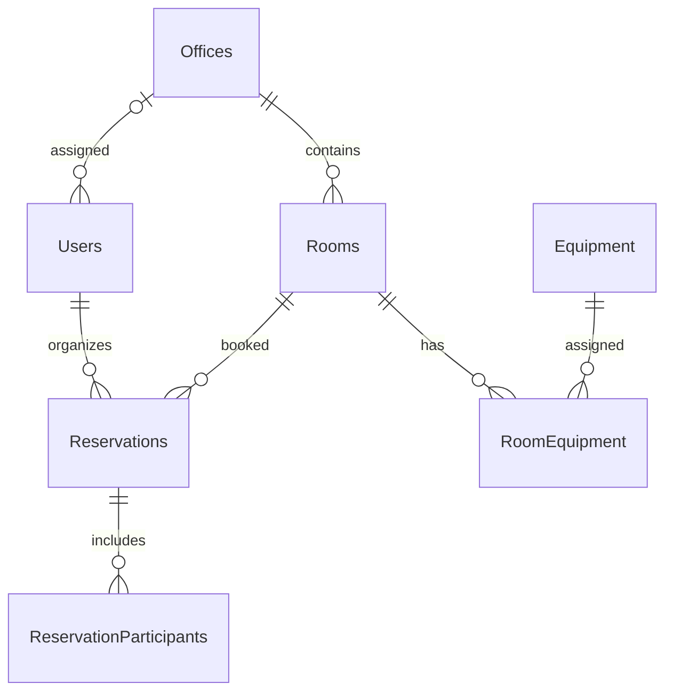

# Meeting Room Booking

Staj projesi: toplantı odası rezervasyon sistemi. Şu anda proje iskeleti, veritabanı modeli ve örnek veri oluşturma hazırdır. API özellikleri sonraki aşamalarda eklenecektir.

## Gerekenler

- .NET 8 SDK veya üzeri
- Git
- MySQL 8 veya üzeri (veritabanı aşamasında kullanılacak)

## Veritabanı modelini kurma (Windows PowerShell)

1. `dotnet --version` komutuyla SDK'nın kurulu olduğunu kontrol et.
2. MySQL 8 sunucusunun çalıştığından emin ol.
3. `Copy-Item src/MeetingRoomBooking.Api/appsettings.Example.json src/MeetingRoomBooking.Api/appsettings.json` çalıştır. Oluşan `appsettings.json` içindeki `YOUR_DB_USER` ve `YOUR_DB_PASSWORD` alanlarını kendi yerel MySQL bilgilerinle değiştir. `Seed:DemoPassword` alanına en az 12 karakterlik ayrı bir test şifresi yaz. Bu dosyayı Git'e ekleme.
4. Repo kökünde `dotnet restore MeetingRoomBooking.sln` ve `dotnet build MeetingRoomBooking.sln` çalıştır.
5. `dotnet tool restore` çalıştır.
6. `dotnet ef database update --project src/MeetingRoomBooking.Data --startup-project src/MeetingRoomBooking.Api` çalıştır. Repodaki hazır migration veritabanına uygulanır; yeniden `migrations add InitialCreate` çalıştırma.
7. `dotnet run --project src/MeetingRoomBooking.Api --no-launch-profile -- --urls http://localhost:5080` çalıştır.
8. Tarayıcıda `http://localhost:5080/swagger` ve `http://localhost:5080/api/status` adreslerini aç.

`src/MeetingRoomBooking.Api/appsettings.Example.json` yalnızca ayarların biçimini gösterir. Gerçek bağlantı ve JWT sırları Git'e yüklenmez. `InitialCreate` migration dosyaları repoda bulunur; içlerinde şifre olmamalıdır. Model değişikliği yapıldığında yeni isimli migration oluşturulur.

## Veritabanı şeması

`RevokedTokens` tablosu JWT çıkış işlemleri için ayrılmıştır. Çakışma koruması rezervasyon API'si aşamasında MySQL transaction ve oda satırını `SELECT ... FOR UPDATE` ile kilitleyerek uygulanacaktır. Oluşturma ve düzenleme işlemleri aynı kilit üzerinden geçecek; kilit altındayken aktif rezervasyonların saatleri yeniden kontrol edilecektir.

## Örnek kullanıcılar

Uygulama ilk açıldığında 2 ofis, 8 oda, 3 kullanıcı ve 2 örnek rezervasyon oluşturulur. Tekrar açıldığında aynı veriler yeniden eklenmez.

| Rol | E-posta | Yetkili ofis |
| --- | --- | --- |
| Admin | admin@meeting.test | Tüm ofisler |
| Ofis Yöneticisi | manager@meeting.test | İstanbul |
| Çalışan | employee@meeting.test | İstanbul |

Üçünün de şifresi yerel `appsettings.json` dosyasında belirlediğin `Seed:DemoPassword` değeridir. Şifreler veritabanında yalnızca hash olarak tutulur. Giriş endpoint'i sonraki aşamada eklenecektir.

Bu aşamada kimlik doğrulama API'si, rezervasyon API'si ve arayüz henüz uygulanmadı.
